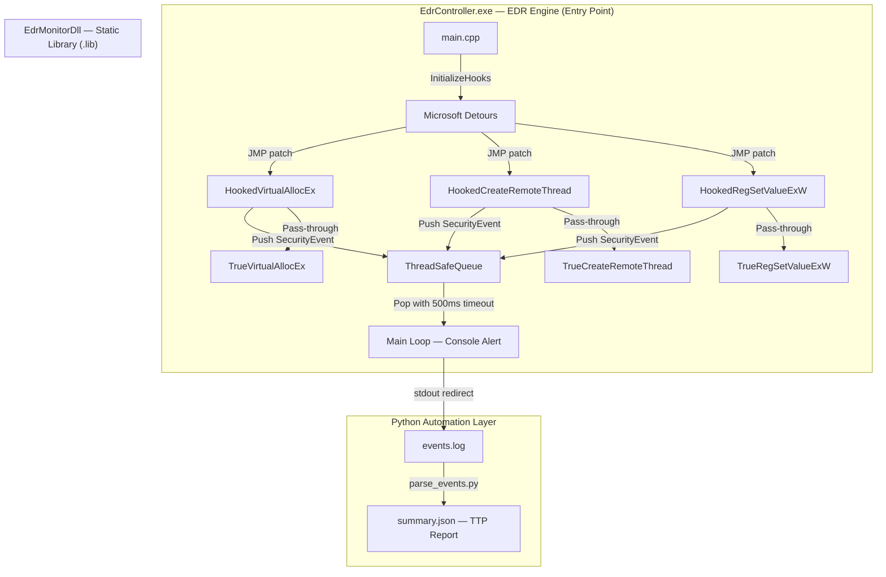

# SentinelLite-EDR

A lightweight **User-space Endpoint Detection and Response (EDR)** proof-of-concept implemented in **Modern C++17**, targeting Windows 10/11 x64.

Designed to demonstrate core EDR engineering concepts: **Inline API Hooking**, **Thread-safe Event Pipeline**, and **Automated Threat Detection** — mapping directly to MITRE ATT&CK TTPs.

---

## Architecture



---

## Project Structure

```
SentinelLite-EDR/
├── SentinelLite-EDR.sln           # Unified solution (one-click build)
│
├── EdrController/                  # Entry point — Console EXE
│   └── controller/
│       └── main.cpp                # Hook init, ThreadSafeQueue, event loop
│
├── EdrMonitorDll/                  # Detection engine — Static Library
│   ├── api_monitor.cpp             # Hook callbacks + SecurityEvent construction
│   ├── hook.cpp / hook.hpp         # Detours transaction management
│   ├── event.hpp                   # SecurityEvent struct + serialization
│   ├── safe_queue.hpp              # Thread-safe queue (move semantics)
│   └── Detours/                    # Microsoft Detours (third-party)
│
├── InjectionDemo/                  # Attack simulator (T1055 PoC)
│   └── InjectionDemo.cpp           # OpenProcess → VirtualAllocEx → CreateRemoteThread
│
└── Scripts/
    └── parse_events.py             # Log parser → JSON TTP report
```

---

## Features

| Feature | Implementation |
|---------|---------------|
| Inline API Hooking | Microsoft Detours — JMP patch on `VirtualAllocEx`, `CreateRemoteThread`, `RegSetValueExW` |
| Thread-safe Event Queue | `std::mutex` + `std::condition_variable`, non-blocking push, drain-on-shutdown |
| Severity Classification | `INFO` / `WARNING` / `CRITICAL` mapped to API risk profile |
| MITRE ATT&CK T1055 Detection | Flags Process Injection pattern: `VirtualAllocEx(PAGE_EXECUTE_READWRITE)` + `CreateRemoteThread` combo |
| Registry Persistence Detection | Monitors `RegSetValueExW` writes, logs `KeyHandle` + `ValueName` |
| Python Automation | `parse_events.py` parses raw log into structured JSON with TTP annotations |
| Modern C++17 | `std::move`, `std::optional`, `[[nodiscard]]`, RAII, `= delete` copy semantics |

---

## Demo

### 1. EDR Console — CRITICAL Alert on Process Injection


When the self-simulation sequence runs, the EDR immediately flags the T1055 attack chain:

```
[INFO    ] PID=7740  API=VirtualAllocEx      Process=EdrController.exe | Local allocation
[CRITICAL] PID=7740  API=VirtualAllocEx      Process=EdrController.exe | RemotePID=7740, Size=4096, Protect=0x40
[CRITICAL] PID=7740  API=CreateRemoteThread  Process=EdrController.exe | RemotePID=7740, StartAddr=0x...
```

### 2. Python Automation — TTP Report


```bash
# Capture EDR output to log file
EdrController.exe > events.log 2>&1

# Generate structured JSON report
python Scripts/parse_events.py events.log
```

Output (`summary.json`):

```json
{
  "total_events": 3,
  "critical_count": 2,
  "ttp_detections": [
    {
      "ttp_id": "T1055",
      "ttp_name": "Process Injection",
      "description": "PID 7740 triggered both VirtualAllocEx(PAGE_EXECUTE_READWRITE) and CreateRemoteThread."
    }
  ]
}
```

---

## Build

**Requirements:** Visual Studio 2019+, Windows 10/11 x64

```
1. Open SentinelLite-EDR.sln
2. Set platform to x64 | Debug
3. Ctrl+Shift+B — Rebuild Solution
4. Run EdrController (set as Startup Project)
```

Build order is enforced by project dependencies:
`EdrMonitorDll (Static Library)` → `EdrController (EXE)` → `InjectionDemo (EXE)`

> **Note:** Run `EdrController.exe` as Administrator to allow `VirtualAllocEx` and `CreateRemoteThread` self-simulation.

---

## Detection Logic

### Hooked APIs & Severity Rules

| API | Condition | Severity | MITRE TTP |
|-----|-----------|----------|-----------|
| `VirtualAllocEx` | `hProcess != GetCurrentProcess()` AND `flProtect` contains `PAGE_EXECUTE_READWRITE` | CRITICAL | T1055 |
| `VirtualAllocEx` | Same process, any protection | INFO | — |
| `CreateRemoteThread` | `hProcess != GetCurrentProcess()` | CRITICAL | T1055 |
| `RegSetValueExW` | Any call | WARNING | T1547.001 |

### TTP Correlation (parse_events.py)

When both `VirtualAllocEx` (CRITICAL) and `CreateRemoteThread` (CRITICAL) are triggered by the same PID, `parse_events.py` automatically annotates the event pair as **T1055 Process Injection**.

---

## Known Limitations & Next Steps

| Limitation | Explanation | Production Solution |
|------------|-------------|---------------------|
| User-space scope | Detours hooks live inside the monitored process; cannot intercept API calls from external processes | Kernel-mode minifilter driver or ETW |
| No anti-tamper | Hooks can be bypassed via Direct Syscalls (`NtAllocateVirtualMemory` directly) | Kernel-level SSDT hook or PatchGuard-compliant driver |
| Single-thread update | `DetourUpdateThread` only covers the current thread during transaction | Enumerate all threads via `CreateToolhelp32Snapshot` |
| Windows-only | Detours and Win32 API are platform-specific | Linux equivalent: `ptrace` or `LD_PRELOAD` hooking |

> These limitations are intentional design trade-offs for a 3-day User-space PoC. The architecture is designed to validate the **Collection Pipeline** and **Detection Rule** correctness before investing in kernel driver development.

---

## References

- [Microsoft Detours](https://github.com/microsoft/detours)
- [MITRE ATT&CK T1055 — Process Injection](https://attack.mitre.org/techniques/T1055/)
- [MITRE ATT&CK T1547.001 — Registry Run Keys](https://attack.mitre.org/techniques/T1547/001/)
