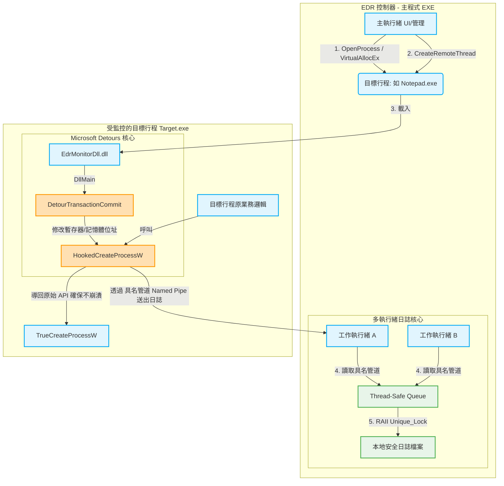

# SentinelLite-EDR
A lightweight user-space Endpoint Detection and Response (EDR) proof-of-concept implemented in modern C++17.

```mermaid
graph TD
    %% 節點樣式定義
    classDef userSpace fill:#e1f5fe,stroke:#03a9f4,stroke-width:2px;
    classDef kernelSpace fill:#ffe0b2,stroke:#ff9800,stroke-width:2px;
    classDef rAII fill:#e8f5e9,stroke:#4caf50,stroke-width:2px;

    %% 模組 A：控制器
    subgraph EDR_Controller [EDR 控制器 - 主程式 EXE]
        A[主執行緒 UI/管理] -->|1. OpenProcess / VirtualAllocEx| B(目標行程: 如 Notepad.exe)
        A -->|2. CreateRemoteThread| B
        
        subgraph Thread_Pool [多執行緒日誌核心]
            C[工作執行緒 A] -->|4. 讀取具名管道| D[Thread-Safe Queue]
            C2[工作執行緒 B] -->|4. 讀取具名管道| D
            D -->|5. RAII Unique_Lock| E[本地安全日誌檔案]
        end
    end

    %% 模組 B：被監控的行程
    subgraph Target_Process [受監控的目標行程 Target.exe]
        B -->|3. 載入| F[EdrMonitorDll.dll]
        
        subgraph Detours_Hook [Microsoft Detours 核心]
            F -->|DllMain| G[DetourTransactionCommit]
            G -->|修改暫存器/記憶體位址| H[HookedCreateProcessW]
        end
        
        I[目標行程原業務邏輯] -->|呼叫| H
        H -->|透過 具名管道 Named Pipe 送出日誌| C
        H -->|導回原始 API 確保不崩潰| J[TrueCreateProcessW]
    end

    %% 套用樣式
    class A,B,C,C2,F,I,J userSpace;
    class G,H kernelSpace;
    class D,E rAII;
```