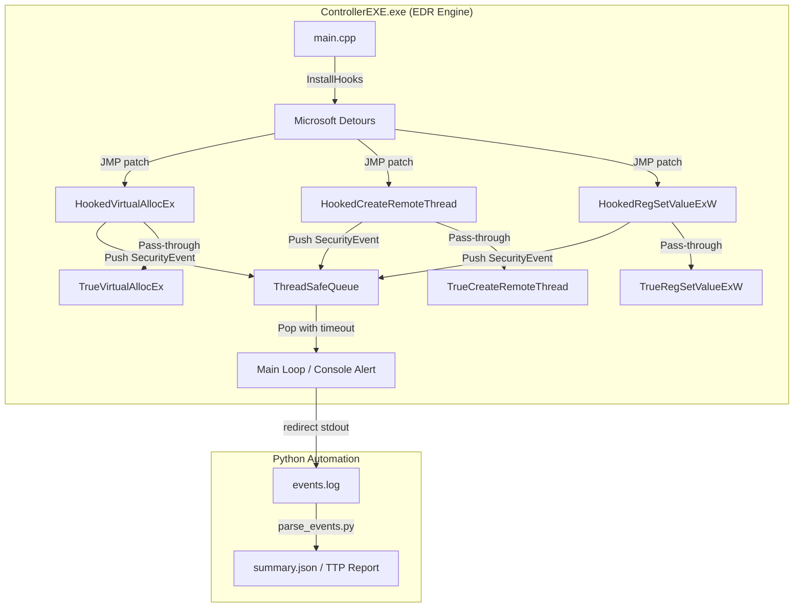

# SentinelLite-EDR

A lightweight user-space Endpoint Detection and Response (EDR) proof-of-concept implemented in modern C++17.

## Architecture

## Features

- **Inline API Hooking** via Microsoft Detours — intercepts `VirtualAllocEx`, `CreateRemoteThread`, `RegSetValueExW`
- **Thread-safe Event Queue** — lock-free push from hook callbacks, blocking pop with timeout in main loop
- **Severity Classification** — `INFO` / `WARNING` / `CRITICAL` mapped to Windows API risk level
- **MITRE ATT&CK T1055 Detection** — flags Process Injection pattern (VirtualAllocEx + CreateRemoteThread combo)
- **Python Automation** — `parse_events.py` parses raw log output into structured JSON report
- **Modern C++17** — `std::move` semantics, `std::optional`, `[[nodiscard]]`, RAII throughout

## Demo

### Detection Output

### Python Report

### Attack Simulation (T1055)
The self-simulation sequence triggers the full T1055 detection chain:
1. `VirtualAllocEx` with `PAGE_EXECUTE_READWRITE` → **CRITICAL**
2. `WriteProcessMemory` → payload written to remote memory
3. `CreateRemoteThread` → **CRITICAL**
4. `parse_events.py` identifies the combo → **T1055 flagged**

### Known Limitations & Next Steps

| Limitation | Explanation | Production Solution |
|------------|-------------|---------------------|
| User-space only | Detours hooks live inside the monitored process; cannot intercept API calls from external processes | Kernel-mode minifilter driver (ETW or SSDT hook) |
| Single-process scope | Self-monitoring PoC; real EDR requires cross-process visibility | Windows kernel callbacks (`PsSetCreateProcessNotifyRoutine`) |
| No anti-tamper | Hooks can be bypassed via Direct Syscalls | Kernel-level protection |

### Build

**Requirements:** Visual Studio 2019+, Windows 10/11 x64, Microsoft Detours

1. Open `EdrMonitorDll.sln` in Visual Studio
2. Set platform to `x64`
3. Build `EdrMonitorDll` (Static Library) first
4. Build `ControllerEXE` (Console Application)
5. Run `ControllerEXE.exe` as Administrator

